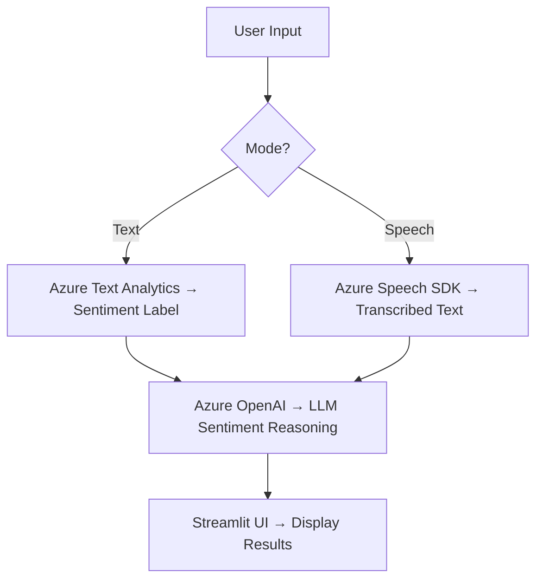

# 🎯 Azure Multimodal Sentiment Analysis App

A **Streamlit web application** that performs **sentiment analysis** on both **text** and **speech**, powered by **Azure AI Services** and **Azure OpenAI (GPT)**.

This app demonstrates a **multimodal AI pipeline** integrating:

* Speech-to-Text transcription
* Text Analytics sentiment detection
* LLM-based reasoning for natural explanations

---

## 🚀 Features

✅ **Text Analytics** – Uses Azure Text Analytics to detect sentiment (Positive / Negative / Neutral).
✅ **Speech-to-Text Analysis** – Converts live microphone audio into text using Azure Speech SDK.
✅ **LLM Sentiment Reasoning** – Sends text to Azure OpenAI (GPT) to get a natural language explanation of sentiment.
✅ **Interactive Streamlit UI** – Choose between Text or Voice input and view detailed results instantly.

---

## 🧠 Tech Stack

* **Python 3.9+**
* **Streamlit** – Web UI
* **Azure Cognitive Services**

  * Speech SDK (Speech-to-Text)
  * Text Analytics (Sentiment Detection)
* **Azure OpenAI (GPT-3.5 / GPT-4)**
* **LangChain OpenAI Wrapper**
* **dotenv** – Manage environment variables

---

## 🧩 Project Flow



---

## ⚙️ Setup Instructions

### 1️⃣ Clone the Repository

```bash
git clone https://github.com/yourusername/azure-sentiment-analyzer.git
cd azure-sentiment-analyzer
```

### 2️⃣ Create Virtual Environment

```bash
python -m venv venv
source venv/bin/activate      # macOS/Linux
venv\Scripts\activate         # Windows
```

### 3️⃣ Install Dependencies

```bash
pip install streamlit azure-cognitiveservices-speech azure-ai-textanalytics azure-core openai langchain-openai python-dotenv SpeechRecognition pydub
```

### 4️⃣ Configure Environment Variables

Create a `.env` file in the root directory:

```bash
# Azure Cognitive Services
AZURE_SPEECH_KEY=your_speech_key
AZURE_SPEECH_REGION=eastus

# Azure Text Analytics
AI_SERVICE_KEY=your_text_analytics_key
AI_SERVICE_ENDPOINT=https://your-text-analytics-resource.cognitiveservices.azure.com/

# Azure OpenAI
OPENAI_API_ENDPOINT=https://your-openai-resource.openai.azure.com/
AI_SERVICE_KEY=your_azure_openai_key
OPENAI_API_VERSION=2024-02-01
DEPLOYMENT_NAME=gpt-35-turbo
```

---

## ▶️ Run the App

```bash
streamlit run app.py
```

Then open your browser at **[http://localhost:8501](http://localhost:8501)**.

---

## 🧠 How It Works

* **Text Input Mode:**

  1. User enters text.
  2. Azure Text Analytics classifies sentiment.
  3. Azure OpenAI explains the result.

* **Voice Input Mode:**

  1. Speech → Text via Azure Speech SDK.
  2. GPT model performs sentiment reasoning on transcribed text.

---

Would you like me to include a **requirements.txt** file for this project too (with exact pinned versions for deployment)?

